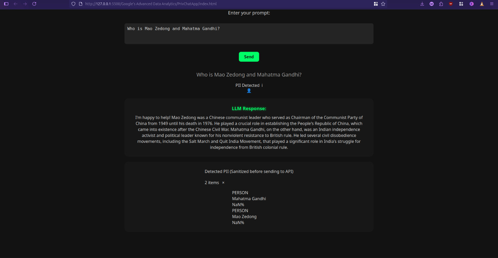

# PrivChat - LLM Engineer Interview Assignment




This project is an implementation of the coding challenge for the LLM Engineer (Founding Team) position. It demonstrates a simple system for processing user prompts, detecting Personally Identifiable Information (PII) using spaCy, and generating a response using a local Large Language Model (LLM) via Ollama.

## Features

*   FastAPI backend for handling prompt processing.
*   Named Entity Recognition (NER) using spaCy (`en_core_web_sm`).
*   Integration with a local LLM deployed via Ollama's REST API.
*   Web-based GUI built with HTML, CSS, and JavaScript.
*   Console output of detected entities and LLM response.
*   Visual display of the processed prompt with potential PII highlights and the LLM response in the GUI (Bonus).
*   A vibrant progress bar shows real-time progress of the data flow from user inputting prompt to the llm response.

## Technologies Used

*   **Backend:** FastAPI (Python)
*   **NER:** spaCy
*   **Local LLM:** Ollama
*   **Frontend:** HTML, CSS, JavaScript
*   **Dependency Management:** Pip

## Setup and Running Instructions

Follow these steps to set up and run the application locally:

1.  **Clone the repository:**
    ```bash
    git clone <your_repository_url>
    cd LLM_Engineer_Assignment/Google's\ Advanced\ Data\ Analytics/PrivChatApp
    ```
    Replace `<your_repository_url>` with the actual URL of your GitHub repository.

2.  **Create and activate a Python Virtual Environment:**
    It's highly recommended to use a virtual environment to manage dependencies.
    ```bash
    python3 -m venv venv
    source venv/bin/activate
    ```

3.  **Install Python Dependencies:**
    Install the required libraries using pip.
    ```bash
    pip install fastapi uvicorn spacy requests
    ```

4.  **Download the spaCy Model:**
    Download the English web small model for spaCy.
    ```bash
    python -m spacy download en_core_web_sm
    ```

5.  **Install Ollama:**
    If you don't have Ollama installed, follow the instructions on the official Ollama website:
    [https://ollama.com/download](https://ollama.com/download)

6.  **Pull the Ollama Language Model:**
    This project is configured to use the `phi` model due to memory constraints on typical development machines. Pull the model using the Ollama CLI:
    ```bash
    ollama pull phi
    ```
    *Note: If you prefer to use a different model, pull it with `ollama pull <model_name>` and update the `model_name` variable in `main.py`.*

7.  **Run the FastAPI Backend:**
    Navigate to the `PrivChatApp` directory if you are not already there and start the FastAPI server.
    ```bash
    cd Google's\ Advanced\ Data\ Analytics/PrivChatApp
    # Ensure your virtual environment is activated: source venv/bin/activate
    uvicorn main:app --reload
    ```
    The server will run on `http://127.0.0.1:8000`.

8.  **Open the Frontend GUI:**
    Open the `index.html` file located in the `Google's Advanced Data Analytics/PrivChatApp/` directory in your web browser.

Now you can enter prompts in the web interface and see the detected PII (if any) and the LLM's response displayed, while also being printed in the terminal where the FastAPI server is running.
